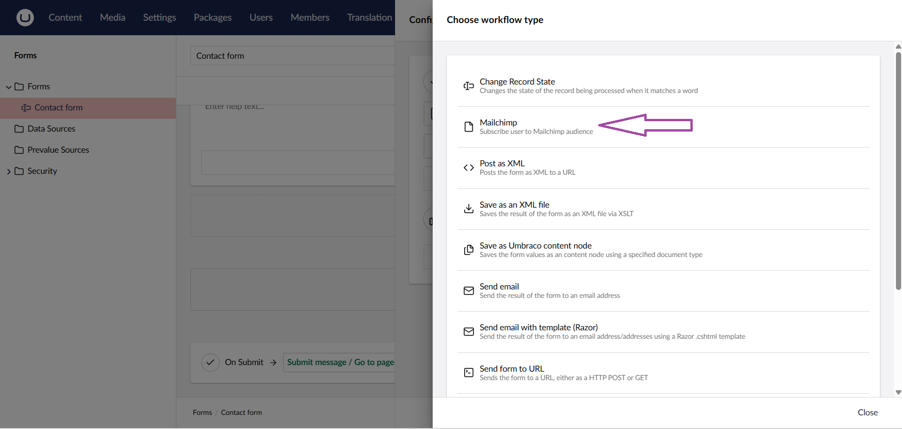
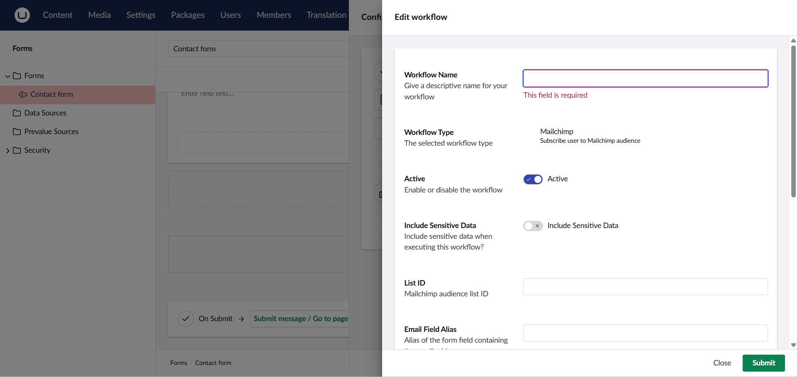
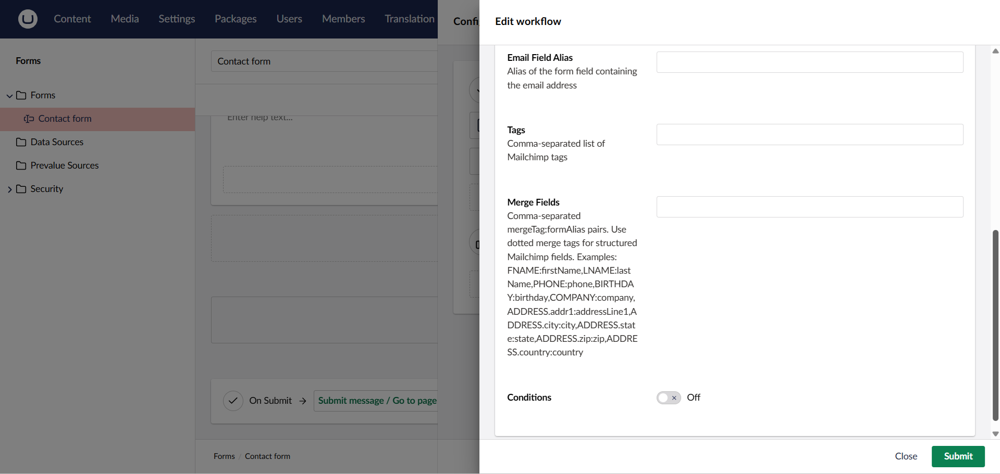

# Mailchimp for Umbraco Forms

Modern Mailchimp integration for Umbraco Forms.
Send form submissions directly to Mailchimp audiences with support for tags, merge fields, and structured data.

## Compatibility

| Umbraco Version | .NET Version |
| --- | --- |
| 17 | .NET 10 |
| 16 | .NET 8 |
| 15 | .NET 8 |
| 14 | .NET 8 |

Supports Umbraco 14&ndash;17.

## Requirements

- Umbraco Forms must be installed
- Mailchimp account and API key required

## Installation

```bash
dotnet add package Mailchimp.Umbraco
```

## Configuration

Add the Mailchimp API key to `appsettings.json` and configure the Mailchimp Audience/List ID on each workflow.

```json
{
  "Mailchimp": {
    "ApiKey": "your-mailchimp-api-key"
  }
}
```

For local demo/testing, use .NET user secrets instead of storing a real API key in source control.

## Features

- Supports Umbraco 14&ndash;17
- Secure API key configuration
- Tags and merge field mapping
- Structured merge fields such as `ADDRESS.*`
- Optional subscription status
- Update existing Mailchimp members

## Screenshots




